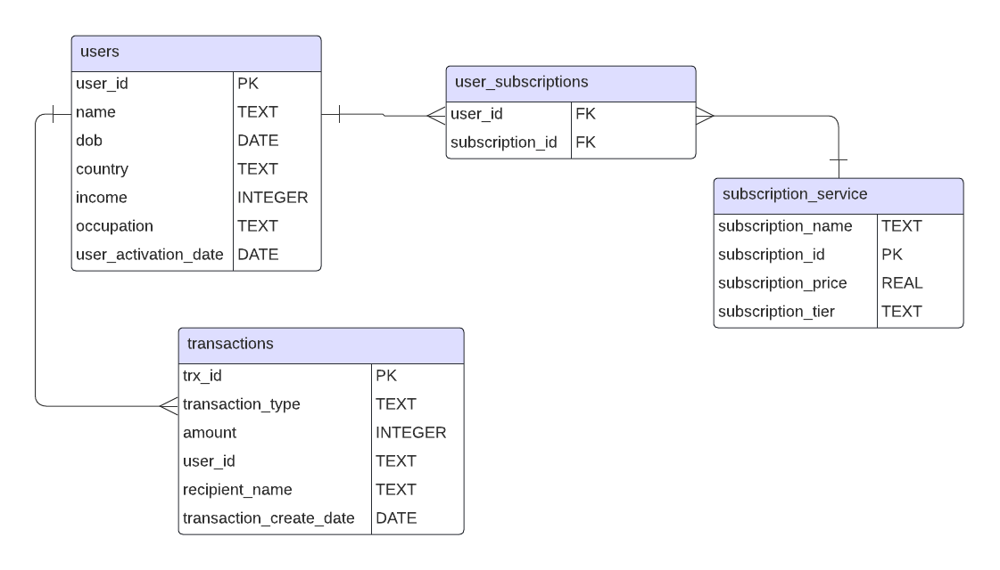

# Database Creation Script

This script is designed to create a SQLite database named `random_data.db` and populate it with fake data for demonstration purposes. It's divided into several sections, each handling different aspects of the database creation and data insertion process. The script utilizes libraries such as `sqlite3`, `faker`, `pandas`, and `uuid` to create a comprehensive dataset that includes users, transactions, subscription services, and user subscriptions.

## Features

- **Database Initialization**: Establishes a connection to a SQLite database, creating the file if it doesn't already exist.
- **Table Creation**: Creates tables for storing users, transactions, subscription services, and user subscriptions data. If any table already exists, it's dropped and recreated.
- **Data Population**:
  - **Users Table**: Populates the table with fake user data, including name, date of birth, country, income, occupation, and user activation date.
  - **Transactions Table**: Inserts fake transaction data linked to user IDs.
  - **Subscription Services Table**: Defines various subscription services available.
  - **User Subscriptions Table**: Associates users with subscription services, allowing for multiple subscriptions per user.

## How to Use

1. **Setup**: Ensure you have Python installed on your machine and the necessary libraries (`sqlite3`, `faker`, `pandas`, `uuid`) are installed. You can install the libraries using pip:

   ```bash
   pip install sqlite3 faker pandas uuid
   ```

2. **Running the Script**: Execute the script in a Jupyter notebook environment or convert it to a `.py` file and run it using Python.

3. **Accessing the Database**: The script creates a database file named `databases/random_data.db`. You can use SQLite tools or libraries to access and query the database.

## Structure

- **Initialization**: Set up the Faker library and establish a database connection.
- **Table Creation**: Separate sections for creating each table (`users`, `transactions`, `subscription_services`, `user_subscriptions`).
- **Data Population**: Detailed steps for generating and inserting data into each table.
- **Database Checks**: Queries to verify the creation of tables and insertion of data, displaying the first 10 rows of each table to ensure correctness.

## Dependencies

- Python 3.x
- sqlite3
- Faker
- pandas
- uuid

## Entity Relationship Diagram (ERD)




## Notes

- The script is meant for demonstration and educational purposes. The generated data is fake and should not be used for any production purposes.
- You can modify the script to adjust the number of data entries or the data generation logic as per your requirements.

---
